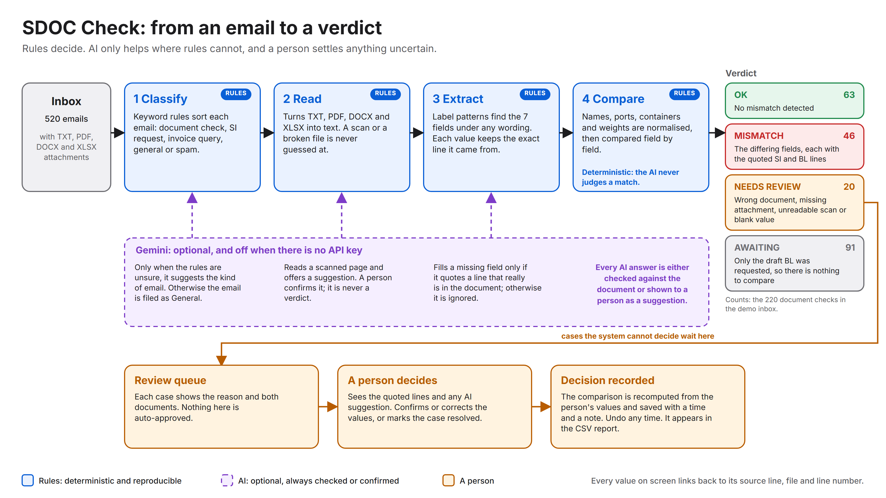

# SDOC Check: shipping document verification

Reads a shipping inbox, finds the emails that ask for a document check, compares the Shipping Instruction (SI)
against the draft Bill of Lading (BL) on seven fields, and reports mismatches. Anything it cannot decide goes to
a person, with the evidence in front of them. Built for the Averis x Monash Hackathon 2026.

**Live demo: https://sdoc-hackathon.vercel.app** (works on a phone; no login)

## Try it in two minutes

Open the live demo and use the search box, or add `#email_004` to the address to open an email directly.

| Email | What it shows |
|---|---|
| `email_001` | A clean check: "No mismatch detected" |
| `email_004` | Two mismatches (consignee, notify party), each with the exact SI and BL line it was read from |
| `email_003` | A request for the draft BL: nothing to compare yet, and it says so instead of passing |
| `email_516` | A blank value: the case goes to review. Fill it in, press *Save & re-check*, then *Undo* |
| `email_501` | Wrong document: the "BL" attachment is really an invoice |
| `email_512`, `513`, `514` | Scanned pages: read by Gemini as a *suggestion*, tagged **AI-assisted**, with a disclaimer |
| `email_519`, `520` | Blank values: Gemini was asked and found nothing, so a grey note says so |

## How it decides

- **Rules decide.** Keyword rules sort the emails, label patterns find the seven fields, and fixed normalisation
  rules compare them. The AI is never asked whether two values match.
- **Every value shows its evidence:** the exact line of the source document, with the file name and line number.
- **Anything uncertain goes to a person:** a blank value, an unreadable scan, the wrong document, wording the
  extractor does not know. It never guesses and never reports a silent pass.
- **Gemini is optional and guarded.** It can classify an email the rules cannot place, fill a missing field only if
  it quotes a line that really is in the document, and read a scanned page as a suggestion. Anything it touches is
  tagged, carries a disclaimer, and needs a person to confirm it.
- **The AI results in this repo come from real calls.** For the three scanned emails (512 to 514) the values in
  `results.json` were produced by Gemini reading the scanned pages, and were then checked against the pages by hand:
  21 of 21 values matched. Nothing is typed in.

## Known limits

- All data is synthetic, and there is no login: reviewer decisions are stored per email, not per user.
- The keyword rules that classify emails were written from this dataset's wording; a real inbox would need them widened.
- On scanned emails only the SI page is read by Gemini; the BL side is left for the reviewer.
- Only cases that need review can be edited in the app.

## Project layout

| File | Job |
|---|---|
| `classify.py` | Stage 1: what kind of email is it? |
| `readers.py`  | Turn txt / pdf / docx / xlsx attachments into plain text |
| `extract.py`  | Find the 7 fields, whatever the label wording, and keep the source line of each |
| `compare.py`  | Normalise values and compare SI vs BL |
| `llm.py`      | Optional Gemini helpers (cached, retried, capped, never crash the run) |
| `pipeline.py` | Runs everything and produces one result per email |
| `app.py` + `static/index.html` | The web app (API + Apple-Mail-style interface) |
| `store.py`    | Where reviewer decisions live: Supabase, or a local file |
| `snapshot.py`, `precompute.py`, `results.json` | Precomputed results with a fingerprint, so start-up is instant |
| `validation/` | Fuzzers, the labelling packet and the validation report |
| `docs/` | Architecture diagrams and the architecture document |
| `supabase/schema.sql` | The one table the app needs |
| `vercel.json` | Vercel settings |
| `tests/` | 71 automated tests |
