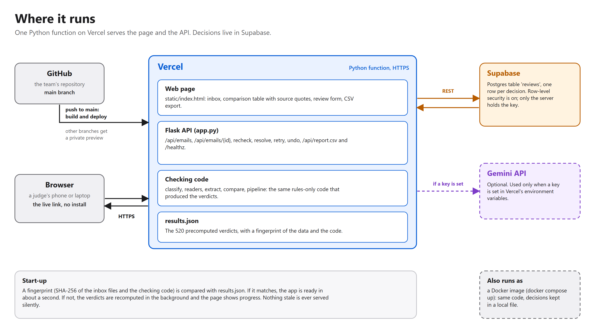

# Architecture

Vector versions: [architecture.svg](architecture.svg), [deployment.svg](deployment.svg). Redraw with `python docs/make_diagrams.py`.

## How a check works

| Step | File | What it does | Fails how |
|---|---|---|---|
| Classify | `classify.py` | Keyword rules place each email in one of five kinds. | Unsure: Gemini suggests a kind if a key is set, otherwise the email is filed as General. |
| Read | `readers.py` | TXT, PDF, DOCX and XLSX become text. | A scan or a corrupt file is reported as unreadable and sent to a person. It is never guessed at. |
| Extract | `extract.py` | Label patterns find the 7 fields under different wordings and keep the exact source line. | A field that cannot be found is missing, so the case goes to a person. |
| Compare | `compare.py` | Names, ports, containers and weights are normalised, then compared per field. | Deterministic. The AI is never asked whether two values match. |
| Explain (optional, offline) | `explain.py` | When it has been run, Gemini writes one or two plain sentences saying what differs in each mismatch and why each review case needs a person. It sees only the compared values and never decides. | A sentence that does not mention the values is dropped and a fixed sentence is used instead. |
| Serve | `app.py`, `static/index.html` | Inbox, comparison table with source quotes, review form, CSV report. | |
| Decide | `store.py` | A person confirms or corrects values. The decision is saved (Supabase, or a local file) and the comparison is recomputed. | |

Verdicts: **OK**, **MISMATCH** (with the differing fields), **NEEDS REVIEW** (wrong document, missing attachment,
unreadable scan, blank value) and **AWAITING** (only the draft BL was requested).

## Design decisions

- **Rules first, AI as a helper.** In the committed run every one of the 520 emails was classified by rules. The
  AI has three narrow jobs, and each is checked: it may fill a missing field only if it quotes a line that really
  appears in the document, it reads scanned pages only as a suggestion for a person, and it classifies an email
  only when the rules are unsure. The result is reproducible and explainable, and it runs with no API key.
- **The AI never judges a match.** Whether two values agree is decided by fixed normalisation rules, so the same
  input always gives the same verdict and each rule can be tested (see the validation report).
- **Uncertainty goes to a person.** A blank value, an unreadable scan, the wrong document or an unfamiliar label
  each produce NEEDS REVIEW, not a guess. The validation lab checks that unfamiliar wording is always escalated
  and never turns into a clean pass.
- **Evidence on screen.** Every value shows the exact line it came from, with the file name and line number, and
  the tests check that each quote is verbatim.
- **Precomputed verdicts.** `results.json` holds the 520 verdicts with a fingerprint of the inbox files and the
  checking code. A matching fingerprint means the app is ready in about a second on a serverless host. A mismatch
  means it recomputes instead of showing stale results.
- **Stateless server, external decisions.** Serverless instances are short-lived, so reviewer decisions live in
  Supabase (row-level security on, only the server holds the key) and are read on every request. Running on your own
  machine without Supabase, a JSON file does the same job.
- **Optional live AI, resilient by design.** The results (and any AI-written reasons) are built offline and saved, so the
  live site makes no Gemini calls while people browse it. If Gemini is busy or out of quota, Retry keeps the saved
  result and the reviewer's decision. A second AI provider is on the roadmap, but only with the scan readings
  re-checked against the pages, because the evidence for AI quality was gathered on Gemini.
- **Deploy from Git.** Pushing to `main` deploys; other branches get a private preview.

## Known limits

- The address after ` | ` in a party name is not compared (only the name), which is how the organisers define a defect.
- The keyword rules that classify emails were written from this dataset's wording, so a real inbox would need them widened.
- Scanned pages are not read automatically; with a Gemini key they become a suggestion for a person.
- Reviewer decisions are stored per email; there is no user login, so this is a demo of the workflow, not a multi-user product.
- See [`validation/REPORT.md`](../validation/REPORT.md) for what was tested and what was not.
